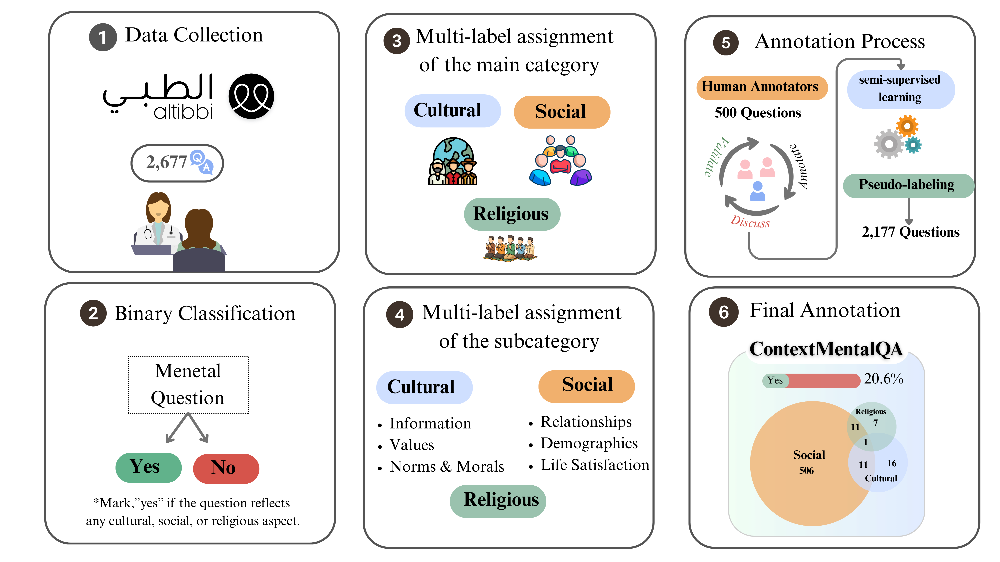

# 🧠 ContextMentalQA  
**Modeling Cultural, Social, and Religious Context in Arabic Mental Health Question Answering**

[](https://ieeexplore.ieee.org/)

[](https://huggingface.co/aubmindlab/bert-base-arabertv02)

---

## 🌍 Overview
**ContextMentalQA** introduces a *socioculturally informed framework* for Arabic mental health question answering.  
It integrates **cultural**, **social**, and **religious** reasoning into model predictions through:
- 🧩 Multi-label annotation schema  
- ⚖️ Imbalance-aware training with class-weighted BCE loss  
- 🧠 Semi-supervised pseudo-labeling for data expansion  
- 🎯 Adaptive per-class threshold calibration for better interpretability  

This repository includes the full implementation (training, inference, and adaptive thresholding) used in our IEEE Access publication.

---

## 📊 Model Architecture

<p align="center">
  
</p>

> **Figure 1.** Overview of the ContextMentalQA model. The system fuses AraBERT embeddings with contextual socio-cultural representations and adaptive threshold calibration for multi-label mental health question classification.

*(Place your architecture diagram or pipeline figure at `figures/contextmentalqa_architecture.png`)*

---

## 🧩 Repository Structure
```
ContextMentalQA/
├── configs/                     # Training configs and thresholds
│   └── default.yaml
│
├── src/contextmentalqa/         # Core package
│   ├── dataset.py               # MentalQADataset for tokenization
│   ├── model.py                 # AraBERT-based multi-label model
│   ├── train.py                 # K-fold training loop
│   ├── infer.py                 # Ensemble inference
│   ├── thresholds.py            # Adaptive per-class threshold computation
│   └── utils.py                 # Metrics, seeding, helper functions
│
├── train.py                     # CLI for training
├── predict.py                   # CLI for inference
├── README.md
└── LICENSE
```

---

## ⚙️ Installation
```bash
git clone https://github.com/<your-username>/ContextMentalQA.git
cd ContextMentalQA
pip install -r requirements.txt
```

---

## 🚀 Training
To train using the default configuration:
```bash
python train.py --config configs/default.yaml
```
This performs **5-fold cross-validation** and saves checkpoints to `checkpoints/`.

---

## 🔍 Inference
To run ensemble inference using trained folds:
```bash
python predict.py --input data/sample_infer.csv   --checkpoints_dir checkpoints/   --output outputs/inference.csv
```

Outputs include per-label probabilities, binary predictions, and combined label lists.

---

## 📈 Evaluation Metrics
| Metric | Description |
|---------|-------------|
| **Micro-F1** | Global harmonic mean of precision and recall |
| **Macro-F1** | Average of per-class F1 scores |
| **Subset Accuracy** | Exact match between predicted and gold label sets |
| **Micro-Jaccard** | Overlap measure for multi-label sets |
| **Hamming Loss** | Fraction of labels misclassified |

---

## 📊 Example Inference Output
| Question | Predicted Labels |
|-----------|------------------|
| هل أنا مريض نفسي؟ | Social\|Relationship |
| أشعر أني بعيد عن الناس | Social\|Life Satisfaction |
| هل الذنب سبب حالتي النفسية؟ | Religion |
| لا أعاني من شيء | No |

---

## 🧠 Citation
If you use **ContextMentalQA** in your research, please cite:

```bibtex
@article{ayash2025contextmentalqa,
  title={ContextMentalQA: Modeling Cultural, Social, and Religious Context in Arabic Mental Health Question Answering},
  author={Ayash, Lama and Alasmari, Ashwag and Alhuzali, Hassan},
  journal={IEEE Access},
  year={2025},
  volume={11},
  publisher={IEEE}
}
```

---

## ⚖️ License
This project is licensed under the **Apache 2.0 License** – see the [LICENSE](LICENSE) file for details.

---

## 🧩 Acknowledgments
Developed by the **ContextMentalQA Research Team**  
Supported by **King Khalid University (KKU)** and **KAUST Academy** collaboration.

---

## 🧷 To-Do
- [ ] Upload pretrained checkpoints  
- [ ] Add Colab demo notebook  
- [ ] Publish dataset card (MentalQA Benchmark)  
- [ ] Release adaptive threshold visualizer  

---

✨ *ContextMentalQA — advancing culturally aware mental health AI for Arabic language communities.*
