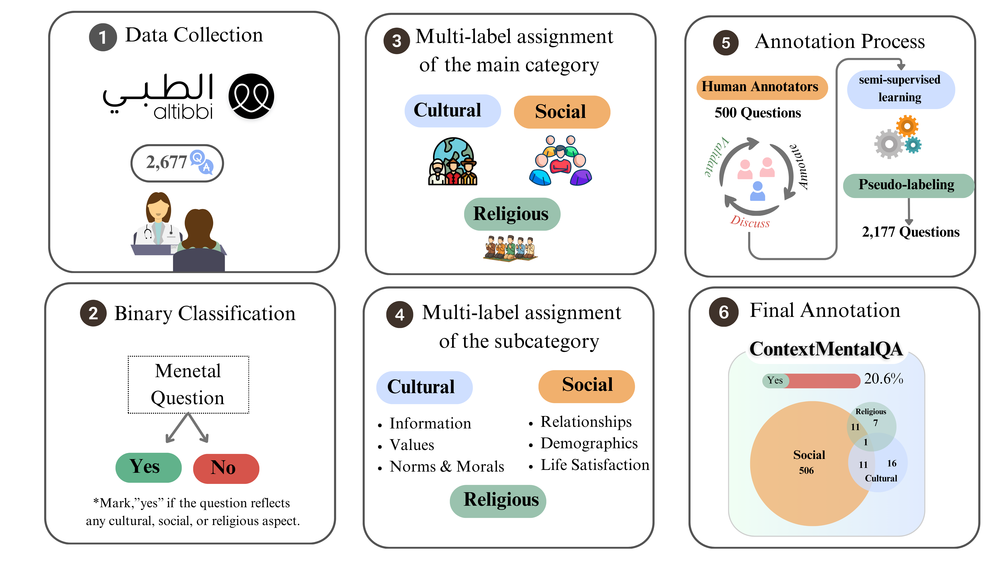

# 🧠 ContextMental
**A Benchmark for Cultural, Social, and Religious Context Understanding in Arabic Mental Health Questions**

[-blue)]()
[](https://huggingface.co/aubmindlab/bert-base-arabertv02)
[]()

---

## 🌍 Overview
**ContextMental** is a benchmark and modeling framework for detecting **cultural**, **social**, and **religious** contextual factors in **Arabic mental health questions**.

Mental health language is not expressed in isolation. In Arabic-speaking contexts, questions about distress, coping, and help-seeking are often shaped by family relationships, social expectations, cultural norms, and religious beliefs. However, most existing Arabic NLP approaches focus mainly on clinical content and overlook these contextual dimensions.

To address this gap, **ContextMental** introduces:

- 🧩 A **multi-label annotation schema** for contextual factors  
- 📚 A benchmark dataset of **2,677 Arabic mental health questions**  
- 🧠 An **AraBERT-based multi-label classification framework**  
- ⚖️ **Class imbalance handling** using weighted BCE loss  
- 🔄 **Semi-supervised pseudo-labeling** for dataset expansion  
- 🎯 **Adaptive per-class threshold calibration**  

This repository contains the implementation for training, inference, and threshold calibration used in the **ContextMental** framework.

---

## 📌 Task Definition
The task is formulated as **multi-label classification** over Arabic mental health questions.

Each question is first assessed for whether contextual framing is present. Contextual instances may then receive one or more labels from the following schema:

### Main categories
- **Cultural**
- **Social**
- **Religious**

### Sub-categories
- **Culture|Information**
- **Culture|Values**
- **Culture|Norms and Morals**
- **Social|Relationship**
- **Social|Demographics**
- **Social|Life Satisfaction**
- **Religion**

---

## 📊 Dataset Summary
- **Total questions:** 2,677  
- **Manually annotated:** 500  
- **Context-positive:** 552  
- **Language:** Arabic  
- **Task:** Multi-label classification  

---

## 🧠 Model Architecture
The framework uses **AraBERT** as the backbone encoder.

### Pipeline
1. Text → Tokenization (AraBERT)
2. Transformer encoding
3. `[CLS]` representation
4. Linear classification head
5. Sigmoid probabilities per label
6. Adaptive thresholds for final prediction

### Key components
- AraBERT v0.2  
- Weighted BCE loss  
- Pseudo-labeling  
- Adaptive thresholding  

---

## 🖼️ Architecture Figure
<p align="center">
  
</p>

---

## 🧩 Repository Structure
```
ContextMental/
├── configs/
│   └── default.yaml
│
├── src/contextmental/
│   ├── dataset.py
│   ├── model.py
│   ├── train.py
│   ├── infer.py
│   ├── thresholds.py
│   └── utils.py
│
├── train.py
├── predict.py
├── requirements.txt
├── README.md
└── LICENSE
```

---

## ⚙️ Installation
```bash
git clone https://github.com/LamaAy/ContextMental.git
cd ContextMental
pip install -r requirements.txt
```

---

## 🚀 Training
```bash
python train.py --config configs/default.yaml
```

- 5-fold stratified CV  
- Weighted BCE  
- Validation-based threshold calibration  

---

## 🔍 Inference
```bash
python predict.py \
  --input data/sample_infer.csv \
  --checkpoints_dir checkpoints/ \
  --output outputs/inference.csv
```

Outputs:
- probabilities  
- binary labels  
- final predictions  

---

## 🎯 Adaptive Thresholding
Each label has its own threshold instead of using a fixed 0.5.

This improves performance under **class imbalance**, especially for rare contextual categories.

---

## 📈 Evaluation Metrics
| Metric | Description |
|--------|------------|
| Micro-F1 | Global performance |
| Macro-F1 | Balanced across labels |
| Subset Accuracy | Exact match |
| Jaccard | Overlap |
| Hamming Loss | Label-wise errors |

---

## 🧪 Experimental Settings
Two setups:

1. **Gold-only**
2. **Gold + pseudo-labeling**

Used to measure impact of semi-supervised learning.

---

## ✨ Why This Matters
- First benchmark for **context-aware Arabic mental health NLP**
- Models **social + cultural + religious reasoning**
- Supports **low-resource learning**
- Improves **interpretability**

---

## 📚 Citation
```bibtex
@article{ayash2026contextmental,
  title={ContextMental: A Benchmark for Cultural, Social, and Religious Context Understanding in Arabic Mental Health Questions},
  author={Ayash, Lama and Alasmari, Ashwag and Alhuzali, Hassan},
  journal={Electronics},
  year={2026},
  note={Under review}
}
```

---

## 🙏 Acknowledgment
Supported by King Khalid University research funding.

---

## 🌱 Closing
**ContextMental** advances culturally aware NLP for Arabic mental health by modeling how people actually express distress in real-world contexts.
